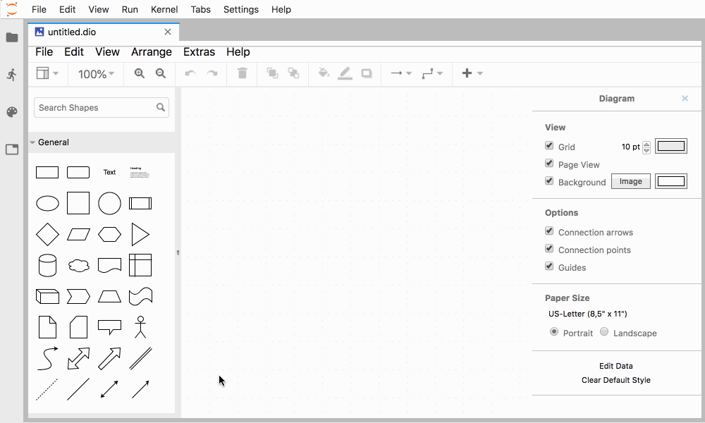

# jupyterlab-drawio

[](http://mybinder.org/v2/gh/QuantStack/jupyterlab-drawio/master?urlpath=lab)


A JupyterLab extension for standalone integration of drawio / mxgraph into jupyterlab.

## Prerequisites

* JupyterLab 1+

## Installation

```bash
jupyter labextension install jupyterlab-drawio
```

## Usage



## Development

For a development install (requires npm version 4 or later), do the following in the repository directory:

```bash
jlpm bootstrap
```

To rebuild the package and the JupyterLab app:

```bash
jlpm build
jupyter lab build
```

## License

The files herein, and especially the source code of mxgraph, is licensed under the Apache 2.0 License.
The copyright holders of draw.io / mxgraph is jgraph (http://www.jgraph.com). The original source code
vendored in this package is taken from: https://github.com/jgraph/mxgraph
